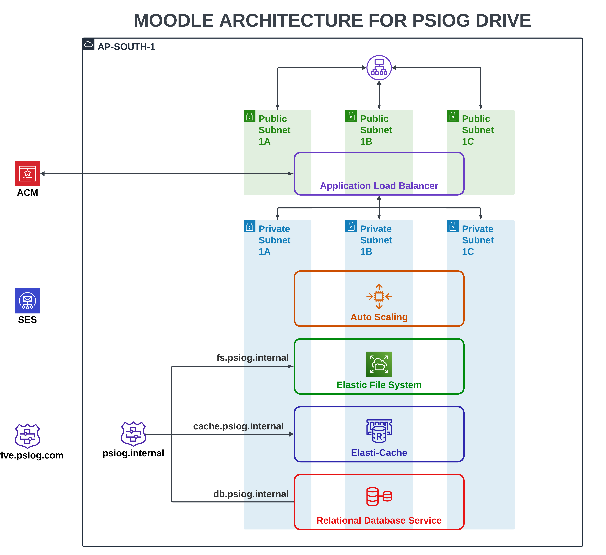

# Moodle Architecture For Psiog Drive

# Modules

1. Network ( VPC ), which also includes
   - 3 Public Subnets with Internet Gateway and a custom route attached
   - 3 Private Subnets with Nat Gateway with Elastic IP and custom route attached
   - 4 Security Groups for the following
     - Web ( 443 )
     - NFS ( 2049 )
     - MYSQL ( 3306 )
     - Redis ( 6379 )
2. ACM ( Amazon Certificate Manager )
3. Route 53, which includes
   - public hosted zone
   - private hosted zone
4. Application Load Balancer, which also includes
   - Listeners
   - Record attachment to route53
   - Target Groups
5. SES ( Simple Email Service )
6. RDS with final snapshot
7. ElastiCache ( Redis )
8. EFS ( Elastic File System)
9. EC2 Auto Scaling